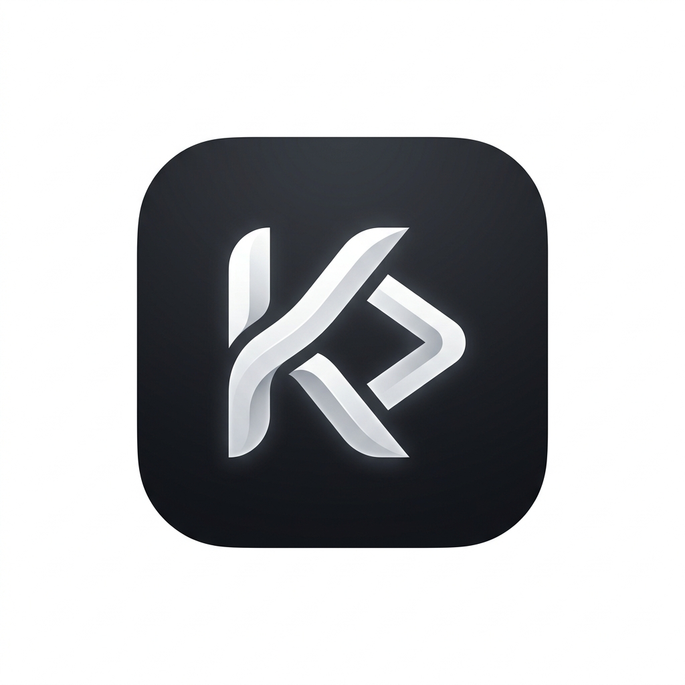
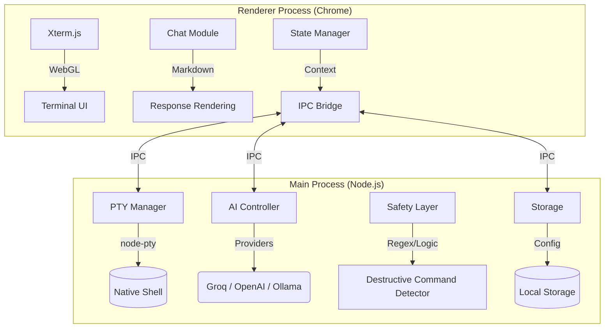

<div align="center">
  
  <h1>Krit</h1>
  <p><b>The AI-Native Terminal Emulator for Modern Workflows</b></p>

  <p>
    
    
    
    
  </p>
</div>

---

**Krit** is a high-performance terminal emulator designed to bridge the gap between the shell and Large Language Models. Built for engineers who live in the CLI, Krit understands your environment, remembers your session context, and helps you execute complex commands safely—all within a unified, hardware-accelerated interface.

## 🚀 Key Features

### 🧠 Context-Aware Intelligence
Krit maintains a background buffer of your terminal scrollback. The integrated AI understands your current directory, hardware specifications, and previous command outputs to provide highly relevant assistance.

### ⌨️ Natural Language Shell
Convert intent into action instantly. Prefix any query with `-` (e.g., `- find all docker volumes over 1GB`) to receive optimized shell commands tailored to your OS and environment.

### 🛡️ Advanced Safety Layer
Execute AI-generated commands with confidence. Krit features a real-time classification engine that detects destructive operations (like `rm -rf`, `dd`, or sensitive config edits) and requires explicit user confirmation before execution.

### 🎨 Modern Aesthetic
Inspired by high-performance CLI tools like `fastfetch`, Krit features a borderless, minimalist UI with a WebGL-powered rendering engine for zero-latency input and smooth text display.

### 🔌 Multi-Provider Support
Choose the brain that powers your terminal. Krit supports:
- **Cloud**: Groq (Llama 3), OpenAI (GPT-4o/o1)
- **Local**: Ollama (for 100% private, offline inference)

## 🏗️ Architecture

Krit is built on a split-process architecture designed for performance, security, and low-latency interaction.



### Core Components

-   **Terminal Engine**: Powered by `xterm.js` with WebGL acceleration. It interfaces with `node-pty` in the main process to handle real-world terminal behaviors and signal passing.
-   **AI Orchestrator**: A modular controller that supports multiple LLM providers. It automatically injects terminal context (CWD, hardware info, scrollback history) into every request.
-   **Security Classification**: A real-time engine that parses AI-generated commands. If a command matches destructive patterns (e.g., `rm -rf`, `dd`, `mkfs`), it is intercepted and requires explicit user consent before being piped to the shell.
-   **Platform Bridge**: Custom IPC implementation ensures that heavy AI processing or terminal I/O doesn't block the UI thread, maintaining a solid 60fps even during high output bursts.

## 📂 Project Structure

```text
src/
├── ai/                # AI Engine logic
│   ├── providers/     # Groq, OpenAI, Ollama adapters
│   ├── controller.js  # Main AI orchestration logic
│   ├── safety.js      # Command classification & security
│   └── context.js     # Scrollback & session management
├── main/              # Electron Main Process
│   ├── index.js       # App entry point & IPC handlers
│   ├── pty.js         # Pseudo-terminal lifecycle management
│   └── wizard.js      # First-run setup & configuration
├── renderer/          # Electron Renderer Process (Frontend)
│   ├── index.html     # Main UI structure
│   ├── renderer.js    # Entry point for the frontend
│   ├── ui.js          # DOM manipulation & screen rendering
│   └── ai.js          # Frontend AI interaction logic
└── config/            # System & user configuration
```

## 📦 Installation

### Linux (AppImage)
The recommended way to run Krit is via the standalone AppImage. 

1. Download `krit-latest.AppImage` from the [latest release](https://github.com/10KRITESH/krit/releases).
2. Make it executable:
   ```bash
   chmod +x krit-latest.AppImage
   ```
3. Launch:
   ```bash
   ./krit-latest.AppImage
   ```

## 🛡️ New in Version 1.0.4

- **Universal Directory Sync**: Now features OSC 7 shell integration to reliably track your working directory across all platforms.
- **Smart Session Recovery**: If your shell crashes or terminates, Krit now offers an instant "Press Enter to Restart" recovery.
- **Enhanced AI Input**: Fully interactive AI prompt buffer with support for arrow keys, middle-of-line editing, and persistent font scaling.
- **Privacy Hardening**: Proactive environment scrubbing to ensure your API keys never leak into the shell's sub-processes.
- **Shortcut Support**: Use `Ctrl+K` to clear scrollback and `Ctrl +/-` to scale the UI (saved across restarts).

## 🛠️ Development

To build Krit from source or contribute:

1. **Clone & Install**:
   ```bash
   git clone https://github.com/10KRITESH/krit.git
   cd krit
   npm install
   ```
2. **Launch Developer Mode**:
   ```bash
   npm start
   ```
3. **Build Distribution Packages**:
   ```bash
   npm run dist
   ```

## 🛡️ Security & Privacy

Krit is built with a security-first philosophy. Standard terminal input is processed locally and never leaves your machine. AI queries are only triggered by explicit user prefixes.

---
*Built for the next generation of command-line power users.*

